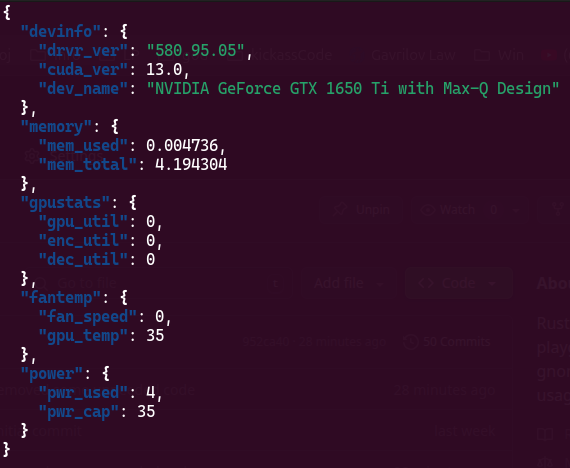
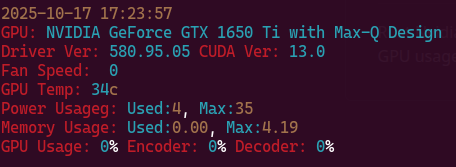

# rnvtop
Rust Nvidia SMI top like program, as a playground for eventually writing a gnome extension for monitoring GPU usage in the toolbar...

## There are 3 different output types

* Tabular

  

* Json

  

* Mutliline print

  
