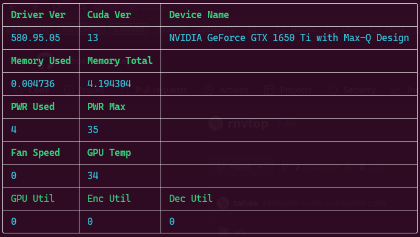

# rnvtop
Rust Nvidia SMI top like program, as a playground for eventually writing a gnome extension for monitoring GPU usage in the toolbar...

## There are 3 different output types

* Tabular `rnvtop -tc`

  

* Json `rnvtop -j`

  

* Mutliline print `rnvtop -lc`

  

* Help (`-h`) output:
```
General Nvidia GPU monitoring

Usage: rnvtop [OPTIONS]

Options:
  -l, --loopit       
  -f, --freq <FREQ>  [default: 1]
  -c, --colorize     
  -j, --json         
  -t, --tabular      
  -h, --help         Print help
  -V, --version      Print version
```
